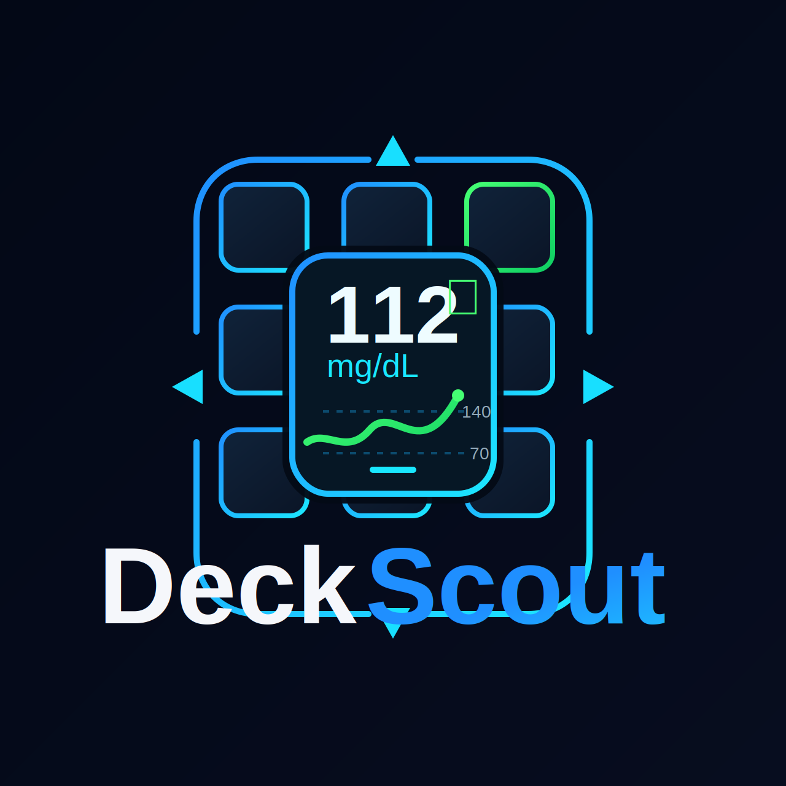

# DeckScout

<p align="center">
  
</p>

<p align="center"><strong>A local-first Stream Deck / VSDinside Nightscout monitor.</strong></p>

A Stream Deck / VSDinside plugin that shows your latest Nightscout glucose reading on a key.

## What it does
- Polls Nightscout every 305 seconds by default
- Renders a dynamic key card instead of plain text
- Shows latest glucose value
- Shows trend arrow
- Shows reading age in minutes
- Shows delta from the previous reading
- Marks low / high / stale / no-data / error states visually
- Supports **mg/dL** and **mmol/L**
- Manual refresh on key press

## Why Nightscout first?
Nightscout removes most of the painful Dexcom-cloud auth work and makes a practical v1 possible.

## Local-first approach
DeckScout is currently optimized for self-hosted Nightscout setups on LAN/Tailscale-style URLs. It reads the latest entries from your Nightscout and does not expose Nightscout auth fields in the plugin UI.

## Current UX
The key renders a color-coded card:
- **green**: in range
- **red**: low
- **amber**: high
- **gray**: stale / no data
- **rose**: fetch error
- **blue**: setup needed

## Project structure
- `src/` - TypeScript source
- `deckscout.sdPlugin/` - compiled plugin payload + manifest + property inspector

## Install
### End users
1. Download the latest `deckscout-vX.Y.Z-vsdinside.zip` release.
2. Import it into VSDinside / Stream Deck.
3. Add **Glucose Monitor** to a key.
4. Enter your Nightscout URL.
   - LAN example: `http://192.168.40.37:1337`
   - Tailscale HTTPS example: `https://nas.tail17fc34.ts.net`
5. Choose units, thresholds, and compact/detailed mode.
6. Press the key once to force a refresh.

### Developers
1. Install Node 24+.
2. Run:
   ```bash
   npm install
   npm run build
   ```
3. Load the `deckscout.sdPlugin` folder into VSDinside / Stream Deck.

## Nightscout API assumption
DeckScout reads from:
- `/api/v1/entries.json?count=2`

The current release is intentionally local-first and assumes a readable Nightscout endpoint.

Expected fields used:
- `sgv`
- `direction`
- `date` or `dateString`

## Repo positioning
Best public framing for now:

**DeckScout — a local-first Stream Deck glucose monitor for Nightscout**

That keeps the setup honest while leaving room for direct Dexcom support later.

## Build status
- Builds successfully with `npm run build`
- Runtime output lands in `deckscout.sdPlugin/plugin/index.js`

## Release notes focus
- local-first Nightscout setup
- VSDinside-compatible runtime
- dynamic glucose card rendering
- compact and detailed layouts
- Tailscale HTTPS-friendly workflow

## Changelog
See [CHANGELOG.md](CHANGELOG.md).

## Notes
- Dexcom data commonly updates every 5 minutes, so `305` seconds is the default poll interval.
- If using mmol/L, adjust thresholds accordingly. Example: `80/180 mg/dL ≈ 4.4/10.0 mmol/L`.
- This is **not** medical advice and should not be used for treatment decisions.

## Branding
- Primary repo/doc logo: `assets/deckscout-logo.svg`
- Plugin/action icons remain simplified for readability at tiny sizes
- Full wordmark is best used in GitHub/docs/release screenshots, not tiny key icons

## Good next features
- threshold presets when switching units
- optional tiny sparkline/history action
- alert/snooze action
- caregiver mode / multiple profiles
- direct Dexcom mode later if it becomes worth the complexity
